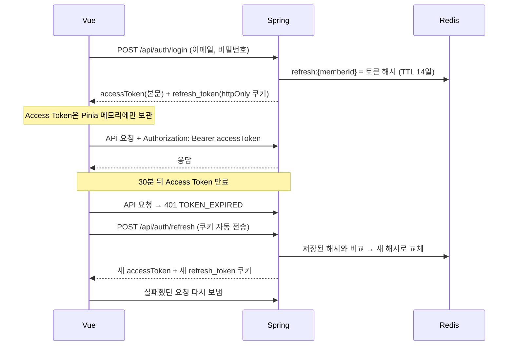
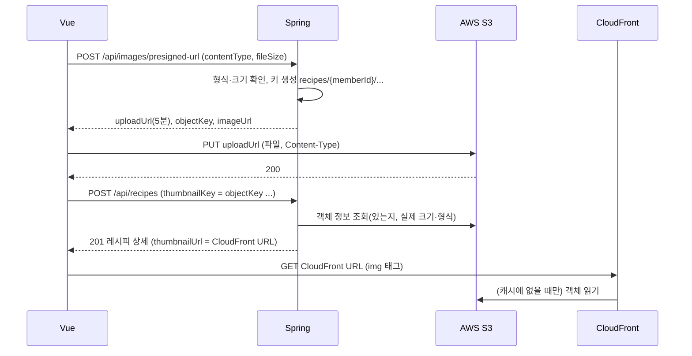

# 프론트-백엔드 연동 (MVP)

> 기준일: 2026-10-02 · 상태: 초안 (구현 전)
> 읽는 때: Vue와 Spring Boot를 연결할 때, 로그인·에러·이미지 처리를 구현할 때

Vue(프론트)와 Spring Boot(백엔드)가 어떻게 연결되는지 정한다. API 경로·형식 자체는 `API_SPEC.md`가 기준이다.

## 1. 개발 환경 구성

### 저장소 구조

```text
my-recipe-v1/
├─ myrecipe_backend/           백엔드 Git 저장소 (GitHub: myrecipe) · IntelliJ로 연다
│   ├─ src/, build.gradle      Spring Boot 프로젝트
│   ├─ docker-compose.yml      MySQL·Redis (+ 6단계 Spring 컨테이너)
│   ├─ .env.example            → 복사해서 .env 를 만든다 (.env는 Git에 올리지 않음)
│   ├─ infra/aws/              AWS 설정 파일 (IAM 정책, 버킷 정책, CORS)
│   ├─ docs/                   설계 문서
│   ├─ notes/                  작업일지, 트러블슈팅
│   ├─ .github/workflows/      CI (ci.yml)
│   ├─ AGENTS.md, CLAUDE.md    AI 도구 규칙
│   ├─ .claude/                Claude Code 개인 설정 (settings.local.json은 Git 제외)
│   └─ Dockerfile, .dockerignore (6단계)
└─ frontend/                   프론트 Git 저장소 (7단계) · VS Code로 연다
```

- 백엔드와 프론트는 **저장소를 나눈다.** 각 IDE가 자기 폴더를 열면 Git을 바로 인식하고, 백엔드 실행에 필요한 것(`.env`, `docker-compose.yml`, AWS 설정)과 문서가 모두 백엔드 저장소 안에 있다.
- 프론트 저장소는 API 규칙을 이 저장소의 `docs/API_SPEC.md`, `docs/INTEGRATION.md`에서 참고한다.

**포트 정리**: Spring 8080, Vue(Vite) 5173, MySQL **3307**(PC에 설치된 MySQL이 3306을 써서 옮김). Docker Desktop의 Kubernetes가 켜져 있으면 실습용 서비스가 8080·5173을 차지할 수 있으니, 이 프로젝트를 돌릴 때는 Kubernetes를 끈다.

### 실행 방법 두 가지

| 모드 | 명령 | Docker로 뜨는 것 | 언제 |
|---|---|---|---|
| 개발 모드 | `docker compose up -d` + `./gradlew bootRun` | MySQL, Redis (사진은 AWS S3) | 평소 개발. Spring을 IDE에서 실행해 디버깅·수정이 빠름 |
| 전체 컨테이너 모드 | `docker compose --profile app up -d --build` | 위 + Spring Boot | 배포와 같은 형태로 돌려볼 때, 다른 PC에서 한 번에 실행할 때 |

두 모드 모두 Vue는 `npm run dev`로 실행하고, Vite 프록시가 `localhost:8080`으로 요청을 넘긴다. Spring이 어느 쪽에서 뜨든 8080이므로 프론트 설정은 같다. 두 모드를 동시에 켜면 8080이 겹치므로 하나만 쓴다.

| 구성 | 주소 | 실행 |
|---|---|---|
| Vue (Vite 개발 서버) | `http://localhost:5173` | `npm run dev` |
| Spring Boot | `http://localhost:8080` | 개발 모드 `./gradlew bootRun` / 전체 모드 `app` 컨테이너 |
| MySQL | `127.0.0.1:3307` (PC에 설치된 MySQL과 겹치지 않게) | `docker compose up -d` |
| Redis | `127.0.0.1:6379` | `docker compose up -d` |
| AWS S3 (사진 저장) | `https://{버킷}.s3.ap-northeast-2.amazonaws.com` | AWS 콘솔에서 만듦 (5단계) |
| CloudFront (사진 보기) | `https://{배포 ID}.cloudfront.net` | AWS 콘솔에서 만듦 (5단계) |

### docker-compose (MySQL + Redis + Spring Boot)

실제 설정은 이 저장소의 **`docker-compose.yml`이 기준**이다. 명령은 저장소 폴더(`myrecipe_backend`)에서 실행한다. 파일 맨 위의 `name: my-recipe-v1`로 컨테이너·볼륨 이름을 고정한다. 이 문서에는 구성과 이유만 적는다.

| 서비스 | 이미지 | 포트 (내 컴퓨터에서만) | 비고 |
|---|---|---|---|
| mysql | `mysql:8.4` | 3307 → 컨테이너 3306 | healthcheck, `mysql-data` 볼륨 |
| redis | `redis:7.4` | 6379 | `--requirepass`로 비밀번호 |
| app | 이 폴더(`build: .`) 빌드 | 8080 | `--profile app`일 때만. 6단계에서 사용 |

사진 저장소는 Docker로 띄우지 않고 **AWS S3**를 쓴다. 설정 방법은 4장.

**사진 저장소 결정 경위 (2026-10)**: 처음에는 로컬 S3 호환 저장소 MinIO를 골랐다. 그런데 MinIO가 무료 커뮤니티 버전 배포를 끝내(2025-10 바이너리 중단, 2026-09 Docker Hub 삭제·quay.io 비공개) 이미지를 받을 수 없게 됐다. MinIO 포크(SILO), RustFS, 과거 버전 직접 빌드를 검토했지만, 모두 "작은 조직 의존"이나 "보안 패치 없음" 문제가 있어 **AWS S3를 직접 쓰기로** 했다. 앱은 처음부터 AWS SDK(S3 API)로 접속하게 설계해서 앱 코드에는 영향이 없다. 교훈: 오픈소스 도구는 기능뿐 아니라 "누가 관리하고 앞으로도 쓸 수 있는가"도 본다.

데이터는 named volume(`mysql-data`)에 남는다. `docker compose down`은 데이터를 지우지 않고, `docker compose down -v`는 볼륨까지 지워 처음 상태로 돌아간다. S3의 사진은 Docker와 상관없이 AWS에 남는다.

- 포트를 `127.0.0.1`에만 연다. 그냥 `"6379:6379"`로 열면 같은 네트워크의 다른 기기에서도 접속할 수 있다. Redis에는 반드시 비밀번호를 건다.

### 컨테이너 안에서는 주소가 달라진다

| 접속 | 개발 모드 (Spring이 내 컴퓨터) | 전체 모드 (Spring이 컨테이너) |
|---|---|---|
| Spring → MySQL | `localhost:3307` | `mysql:3306` (컨테이너끼리는 원래 포트) |
| Spring → Redis | `localhost:6379` | `redis:6379` |
| Spring → AWS S3 | AWS 주소 (리전으로 자동) | 같음 |
| 브라우저 → CloudFront (`STORAGE_PUBLIC_URL`) | `https://{배포 ID}.cloudfront.net` | 같음 |

- 컨테이너 안의 `localhost`는 그 컨테이너 자신이다. 다른 컨테이너는 docker-compose 서비스 이름으로 찾는다.
- S3와 CloudFront는 인터넷의 AWS 주소라서 모드와 상관없이 같다. 대신 Spring이 컨테이너로 돌 때도 AWS 키를 환경 변수로 넣어 줘야 한다.
- 주소는 코드에 쓰지 않고 모두 환경 변수로 받기 때문에, 모드가 바뀌어도 코드는 그대로다.

### Dockerfile (Spring Boot)

저장소 루트(`myrecipe_backend/`)에 둔다(docker-compose의 `build: .`). 빌드 단계와 실행 단계를 나눈 **멀티 스테이지 빌드**로, 최종 이미지에는 JDK·소스·Gradle 없이 JRE와 jar만 남긴다.

```dockerfile
# 1단계: 빌드 (JDK + Gradle)
FROM eclipse-temurin:21-jdk AS build
WORKDIR /workspace
COPY gradlew settings.gradle build.gradle ./
COPY gradle gradle
# Windows에서 만든 파일은 실행 권한이 없을 수 있다
RUN chmod +x gradlew
# 의존성만 먼저 받아 캐시 (소스가 바뀌어도 재사용)
RUN ./gradlew dependencies --no-daemon
COPY src src
# 테스트는 CI에서 따로 실행
RUN ./gradlew bootJar --no-daemon -x test

# 2단계: 실행 (JRE + jar)
FROM eclipse-temurin:21-jre
WORKDIR /app
RUN useradd --system --uid 1001 app
COPY --from=build /workspace/build/libs/*.jar app.jar
# root가 아닌 사용자로 실행
USER app
EXPOSE 8080
ENTRYPOINT ["java", "-jar", "app.jar"]
```

`.dockerignore`로 빌드에 필요 없는 파일을 빼서 빌드를 빠르게 하고 비밀 값이 이미지에 들어가지 않게 한다.

```text
.git
.gradle
build
.idea
*.iml
.env
HELP.md
```

- 비밀 값(`.env`)은 이미지에 넣지 않고 실행할 때 환경 변수로 넣는다. **`.env`가 Dockerfile과 같은 폴더에 있으므로 `.dockerignore`의 `.env` 줄을 절대 빼지 않는다.** 빠지면 `COPY`로 비밀 값이 이미지에 들어간다.
- Dockerfile의 `#` 주석은 줄 맨 앞에서만 주석이다. `USER app  # 설명`처럼 명령 뒤에 쓰면 인자로 읽혀 오류가 난다.
- 컨테이너의 기본 시간대는 UTC다. docker-compose의 `app`에 `TZ: Asia/Seoul`을 넣어 개발 모드와 `createdAt` 시간이 같게 한다.
- 베이스 이미지 태그는 구현할 때 확정하고 고정한다.

### 프록시로 연결 (CORS 없이)

브라우저 입장에서 5173과 8080은 다른 출처(origin)라서 그대로 호출하면 CORS 에러가 난다. 개발 중에는 **Vite 프록시**로 `/api` 요청을 8080으로 넘겨 같은 출처처럼 보이게 한다. 사진은 브라우저가 AWS S3·CloudFront와 직접 주고받으므로 프록시하지 않는다([4. 이미지](#4-이미지-업로드와-표시)).

```js
// vite.config.js
export default defineConfig({
  server: {
    strictPort: true,  // 5173이 막혀 있으면 다른 포트로 몰래 바꾸지 말고 에러를 낸다 (S3 CORS 출처가 어긋나지 않게)
    proxy: {
      '/api': 'http://localhost:8080',
    },
  },
})
```

- 프론트 코드에서는 항상 `/api/...` 같은 상대 경로로 호출한다. `http://localhost:8080`을 코드에 적지 않는다.
- 같은 출처로 보이므로 Refresh Token 쿠키도 별도 설정 없이 오간다. 그래서 MVP에서는 Spring에 CORS 설정을 두지 않는다.
- 나중에 프론트를 다른 도메인에 배포하면 CORS 설정(허용 출처를 정확히 지정, `*` 금지, 쿠키 때문에 `allowCredentials(true)`)과 쿠키의 `SameSite`·`Secure` 설정을 다시 정해야 한다. 같은 도메인에서 Nginx가 정적 파일과 `/api`를 함께 처리하면 지금 설정 그대로 쓸 수 있다.

### 환경 변수

비밀 값은 코드와 Git에 넣지 않고 환경 변수로 받는다. 예시 값만 담은 `.env.example`을 저장소에 둔다.

- docker-compose는 같은 폴더의 `.env`를 자동으로 읽는다.
- Spring Boot(`bootRun`)는 `.env`를 자동으로 읽지 않는다. 그래서 `application.yaml`에 `spring.config.import: optional:file:.env[.properties]`를 두어 `myrecipe_backend/.env`를 읽게 한다(bootRun·테스트·IntelliJ 실행 모두 `myrecipe_backend/`가 작업 폴더).

| 변수 | 용도 |
|---|---|
| `DB_URL`, `DB_USERNAME`, `DB_PASSWORD`, `DB_ROOT_PASSWORD` | MySQL 접속 |
| `REDIS_HOST`, `REDIS_PORT`, `REDIS_PASSWORD` | Redis 접속 |
| `JWT_SECRET` | JWT 서명 키 (충분히 긴 임의 문자열) |
| `JWT_ACCESS_EXPIRATION_SECONDS` | Access Token 유효 시간, 기본 1800 (30분) |
| `JWT_REFRESH_EXPIRATION_SECONDS` | Refresh Token 유효 시간·Redis TTL, 기본 1209600 (14일) |
| `COOKIE_SECURE` | 쿠키 `Secure` 여부. 로컬(http)은 `false`, HTTPS 배포는 `true` |
| `STORAGE_REGION` | S3 리전. `ap-northeast-2`(서울) |
| `STORAGE_BUCKET` | S3 버킷 이름. 전 세계에서 하나뿐이어야 한다(예: `myrecipe-images-본인아이디`) |
| `STORAGE_PUBLIC_URL` | 사진을 보여줄 CloudFront 주소. 공개 URL을 만들 때 씀 |
| `STORAGE_ACCESS_KEY`, `STORAGE_SECRET_KEY` | 앱 전용 IAM 사용자의 접속 키 (버킷의 `recipes/` 아래 객체 읽기·쓰기·삭제만 가능) |

## 2. 인증 연동

### 전체 흐름



### 프론트 (Vue)

**토큰 보관**
- Access Token은 Pinia 스토어(`useAuthStore`)의 **메모리에만** 둔다. `localStorage`에 저장하지 않는다(XSS로 읽힐 수 있음).
- Refresh Token은 httpOnly 쿠키라서 자바스크립트가 읽을 수 없고, 브라우저가 `/api/auth/**` 요청에 자동으로 붙인다. 프론트 코드는 Refresh Token을 직접 다루지 않는다.
- 새로고침하면 메모리의 Access Token이 사라진다. 그래서 **앱 시작 시 `POST /api/auth/refresh`를 한 번 호출**해 로그인 상태를 복구한다. 성공하면 로그인 상태, 401이면 비로그인 상태로 시작한다.
- 로그아웃: `POST /api/auth/logout` 호출 후 스토어의 Access Token과 내 정보를 지운다.

**axios 인스턴스와 인터셉터** (`src/api/http.js` 한 곳에서만 설정)

```js
const http = axios.create({ baseURL: '/api' })

// 요청: Access Token이 있으면 헤더에 붙인다
http.interceptors.request.use((config) => {
  const token = useAuthStore().accessToken
  if (token) config.headers.Authorization = `Bearer ${token}`
  return config
})

// 동시에 여러 요청이 401을 받아도 재발급은 한 번만 하도록 진행 중인 요청을 공유한다
let refreshing = null

http.interceptors.response.use(
  (res) => res,
  async (error) => {
    const { config, response } = error
    const auth = useAuthStore()

    // Access Token 만료: 재발급 후 원래 요청을 한 번만 다시 보낸다
    if (response?.data?.code === 'TOKEN_EXPIRED' && !config._retried) {
      config._retried = true
      try {
        refreshing ??= auth.refresh().finally(() => { refreshing = null }) // POST /api/auth/refresh
        await refreshing
        return http(config)
      } catch {
        // 재발급 실패는 아래 공통 처리로
      }
    }

    // 그 밖의 401(재발급 실패 포함): 로그아웃 상태로 만들고, 로그인이 필요한 화면이면 로그인으로
    if (response?.status === 401) {
      auth.clear()
      if (router.currentRoute.value.meta.requiresAuth) {
        router.push({ name: 'login', query: { redirect: router.currentRoute.value.fullPath } })
      }
    }
    return Promise.reject(error)
  },
)
```

- `auth.refresh()`는 인터셉터가 없는 별도 axios 호출로 `/api/auth/refresh`를 부른다. 같은 인스턴스를 쓰면 재발급 실패가 다시 재발급을 부르는 무한 반복이 생길 수 있다.

**여러 탭에서 동시에 재발급하지 않기 (Web Locks API)**

`refreshing` 공유는 한 탭 안에서만 동작한다. 탭이 두 개면 둘이 거의 동시에 같은 Refresh Token 쿠키로 재발급을 요청할 수 있고, 늦게 도착한 요청은 서버가 "이미 교체된 토큰의 재사용"으로 보고 Redis 키를 지워 **정상 사용자가 로그아웃**된다. 서버의 재사용 감지를 느슨하게 하지 않고, 브라우저의 Web Locks API로 탭 사이에서 재발급을 한 번에 하나씩만 하게 한다.

```js
// useAuthStore의 refresh()
async refresh() {
  // 같은 출처의 모든 탭이 'auth-refresh' 잠금을 공유한다. 앞 탭이 끝날 때까지 기다린다.
  return navigator.locks.request('auth-refresh', async () => {
    // 앞 탭이 이미 재발급했으면 쿠키가 새 토큰으로 바뀌어 있으므로, 이 요청도 새 쿠키로 나간다
    const { data } = await refreshClient.post('/api/auth/refresh') // 인터셉터 없는 axios
    this.accessToken = data.accessToken
  })
}
```

- 잠금 안에서 요청을 보내므로, 뒤 탭의 요청에는 앞 탭이 받은 **새 쿠키**가 실린다. 재사용으로 오인되지 않는다.
- 서버 쪽 규칙(예전 토큰이 오면 키 삭제)은 그대로 둔다. 진짜 탈취된 토큰을 막는 장치이기 때문이다.

**라우터 가드**
- 로그인이 필요한 화면은 `meta: { requiresAuth: true }`를 붙이고, 로그인 상태가 아니면 로그인 화면으로 보낸다. 로그인 후에는 `redirect` 쿼리의 원래 화면으로 돌아간다.
- 앱 시작 시 재발급 시도가 끝난 뒤에 가드를 판단한다(끝나기 전에 판단하면 로그인한 사용자도 로그인 화면으로 튕긴다).
- 가드는 화면 편의 기능일 뿐이다. 실제 권한 확인은 항상 서버가 한다.
- 수정·삭제 버튼은 `writer.memberId`가 내 `memberId`와 같을 때만 보여준다. 이것도 화면 편의이고, 서버가 403으로 막는다.

### 백엔드 (Spring Security)

| 설정 | 값 | 이유 |
|---|---|---|
| 세션 | `STATELESS` | 로그인 상태를 서버 세션이 아니라 토큰으로 판단 |
| CSRF | 끔 | 일반 API는 쿠키가 아닌 `Authorization` 헤더로 인증하므로 CSRF 대상이 아님. 쿠키를 쓰는 `/api/auth/refresh`, `/api/auth/logout`은 `SameSite=Strict` 쿠키로 다른 사이트에서 보낸 요청에 쿠키가 붙지 않게 막음 |
| 폼 로그인·HTTP Basic | 끔 | 로그인은 `/api/auth/login` API로만 |
| JWT 필터 | `UsernamePasswordAuthenticationFilter` 앞에 등록 | 컨트롤러보다 먼저 Access Token 검증 |
| 보안 헤더 | Spring Security 기본값 유지 (`headers()`를 끄지 않음) | `X-Content-Type-Options: nosniff`, `X-Frame-Options: DENY`, 응답 캐시 금지가 기본으로 붙음 |

**인증 없이 허용하는 요청** (API_SPEC의 인증 열 `-`, `선택`, `쿠키`)

```text
POST /api/members/signup
POST /api/auth/login, /api/auth/refresh, /api/auth/logout
GET  /api/recipes, /api/recipes/{id}
GET  /api/recipes/{id}/comments
*    /error   (Spring 내부 에러 경로)
```

- `/error`: 컨트롤러 밖에서 처리되지 않은 예외는 Spring이 `/error`로 넘긴다. 이 경로가 막혀 있으면 원래 에러(400·404·500) 대신 401이 보여 원인을 숨긴다. 응답에 스택 트레이스·예외 메시지가 나가지 않도록 Spring Boot 기본값(`server.error.include-stacktrace: never`, `include-message: never`)을 바꾸지 않는다.

나머지는 모두 Access Token 필요. `/api/auth/refresh`, `/api/auth/logout`은 Access Token 대신 컨트롤러에서 쿠키의 Refresh Token을 직접 검증한다.

**Refresh Token 쿠키 발급**

Spring의 `ResponseCookie`로 만든다.

| 속성 | 값 | 이유 |
|---|---|---|
| `HttpOnly` | true | 자바스크립트가 읽지 못하게 (XSS 대비) |
| `SameSite` | Strict | 다른 사이트에서 보낸 요청에는 쿠키를 붙이지 않음 (CSRF 대비) |
| `Path` | `/api/auth` | 재발급·로그아웃 요청에만 쿠키가 실려 가게 |
| `Max-Age` | Refresh Token 유효 시간 | Redis TTL과 같게 |
| `Secure` | `COOKIE_SECURE` 값 | HTTPS 배포에서는 true. 로컬 http에서는 false여야 쿠키가 저장됨 |

**Redis 연동**
- Spring Data Redis의 `StringRedisTemplate`을 쓴다. 키 `refresh:{memberId}`, 값은 Refresh Token의 SHA-256 해시, TTL은 Refresh Token 유효 시간.
- 로그인: 저장(덮어쓰기). 재발급: 해시 비교 후 새 값으로 저장. 로그아웃: 삭제.
- **로그인 시도 제한**: 같은 이메일로 로그인이 5번 실패하면 15분 동안 그 이메일의 로그인을 막는다(429 `LOGIN_TOO_MANY_ATTEMPTS`). 키 `login-fail:{email}`에 실패 횟수를 `INCR`로 올리고, 첫 실패 때 TTL 15분을 건다. 막힌 동안은 비밀번호를 확인하지 않고 바로 거부한다. 로그인에 성공하면 키를 지운다. 비밀번호를 무작위로 계속 넣어 보는 공격(무차별 대입)을 막는다.
  - 한계: 다른 사람이 내 이메일로 일부러 5번 틀리면 나도 15분간 로그인하지 못한다. 기간을 짧게 두어 피해를 줄이고, MVP에서는 받아들인다.
- Redis가 꺼져 있으면 로그인·재발급이 실패한다. 이때는 500 `INTERNAL_ERROR`로 응답하고 원인은 로그에 남긴다. Access Token이 살아 있는 동안 일반 API는 Redis 없이 동작한다.

**JWT 필터 동작**
- **`/api/auth/`로 시작하는 요청은 검사하지 않는다** (`OncePerRequestFilter`의 `shouldNotFilter`). 로그인은 이메일·비밀번호, 재발급·로그아웃은 쿠키의 Refresh Token으로 판단하므로 Access Token은 의미가 없다. 검사하면 만료된 Access Token 때문에 로그아웃 요청이 막히고, 로그아웃하려다 토큰이 새로 발급되는 일이 생긴다.
- **토큰 종류를 확인한다.** Access Token과 Refresh Token은 같은 키로 서명하므로, 페이로드에 `type` 클레임(`access` / `refresh`)을 넣는다. 필터는 `type=access`만, 재발급은 `type=refresh`만 받는다. 확인하지 않으면 14일짜리 Refresh Token을 Access Token처럼 쓸 수 있다.
- 서명 알고리즘은 HS256으로 고정하고, 토큰 헤더의 `alg` 값을 믿지 않는다. `JWT_SECRET`은 32바이트(256비트) 이상이어야 하며, 짧으면 앱이 시작되지 않게 한다.
- `Authorization` 헤더가 없으면 그냥 통과시킨다. 인증이 필요한 API라면 뒤에서 401이 난다.
- 헤더가 있으면 검증한다. 성공하면 로그인 사용자를 SecurityContext에 넣고, 실패하면(만료·위조) 허용된 API여도 401(`TOKEN_EXPIRED`, `TOKEN_INVALID`)로 응답한다. 프론트는 `TOKEN_EXPIRED`면 재발급하고, `TOKEN_INVALID`면 로그아웃 상태로 만든다.

**필터에서 난 에러도 같은 에러 형식으로**

Spring Security 필터에서 난 예외는 컨트롤러 밖에서 일어나서 `@RestControllerAdvice`가 잡지 못한다. 그래서 따로 처리해 API_SPEC의 에러 형식으로 응답한다.

| 상황 | 처리 위치 | 응답 |
|---|---|---|
| 토큰 없이 인증 필요 API 호출 | `AuthenticationEntryPoint` 구현 | 401 `UNAUTHORIZED` |
| Access Token 만료·위조 | JWT 필터에서 직접 응답 | 401 `TOKEN_EXPIRED` / `TOKEN_INVALID` |
| Refresh Token 없음·만료·불일치 | 재발급 컨트롤러·서비스에서 `BusinessException` | 401 `REFRESH_TOKEN_INVALID` |
| 인가 실패 | `AccessDeniedHandler` 구현 | 403 (MVP는 역할이 하나라 거의 없음) |
| 작성자가 아닌 수정·삭제 | Service에서 `BusinessException` | 403 `RECIPE_FORBIDDEN` / `COMMENT_FORBIDDEN` |

## 3. 에러 처리 연동

서버는 항상 `{ status, code, message, fieldErrors }` 형식으로 에러를 보낸다. 프론트는 `code`를 기준으로 처리한다.

| 경우 | 프론트 처리 |
|---|---|
| 400 `INVALID_INPUT` | `fieldErrors`를 해당 입력칸 아래에 표시 |
| 401 | 인터셉터가 처리. `TOKEN_EXPIRED`면 재발급 후 재시도, 그 밖의 401은 로그아웃 상태로 만들고 필요하면 로그인 화면으로 |
| 403, 404, 409 | `message`를 알림으로 표시. 404면 목록 화면으로 이동 |
| 500, 응답 없음(네트워크 오류) | "잠시 후 다시 시도해 주세요." 공통 알림 |

- 프론트에서도 같은 입력 규칙(길이 등)을 먼저 검사해 바로 알려준다. 단, 최종 검증은 서버가 한다.
- 레시피·댓글처럼 사용자가 쓴 글은 항상 `{{ }}`로 출력한다. `v-html`을 쓰지 않는다(XSS). Access Token이 메모리에 있어도 XSS가 나면 읽힐 수 있으므로 이 규칙이 토큰 보호의 전제다.
- 화면 문구를 `code`별로 바꾸고 싶으면 프론트에 `code → 문구` 표를 두고, 없으면 서버 `message`를 쓴다.

## 4. 이미지 업로드와 표시

사진은 **AWS S3**에 저장하고 **CloudFront**로 보여준다. 서버는 업로드 URL만 서명하고, 파일은 브라우저와 S3가 직접 주고받는다.



### AWS 구성

| 구성 | 설정 | 이유 |
|---|---|---|
| S3 버킷 | 서울 리전, **퍼블릭 액세스 차단 4개 모두 켬**(기본값), 버전 관리 끔, 기본 암호화(SSE-S3) | 버킷을 직접 공개하지 않는다. 공개 버킷 설정 실수는 실제로 자주 나는 유출 사고다 |
| CloudFront | 원본 = S3 버킷, **OAC(Origin Access Control)**로 S3 접근, 뷰어 프로토콜 HTTPS로 리디렉션 | 브라우저는 CloudFront로만 사진을 본다. S3는 CloudFront에게만 읽기를 허락한다 |
| 버킷 정책 | `infra/aws/bucket-policy-cloudfront.json` — CloudFront 배포 하나만 `s3:GetObject` 허용 | 최소 권한 |
| 버킷 CORS | `infra/aws/bucket-cors.json` — 출처 `http://localhost:5173`, 메서드 `PUT`, 헤더 `Content-Type`만 | 브라우저 직접 업로드에 필요한 것만 허용 |
| 앱 전용 IAM 사용자 | `infra/aws/iam-app-policy.json` — `recipes/*` 객체의 `GetObject`·`PutObject`·`DeleteObject`만. 콘솔 로그인 없음 | 키가 유출돼도 이 폴더의 사진만 영향받는다 |

정책 파일의 `YOUR-BUCKET-NAME`, `YOUR-ACCOUNT-ID`, `YOUR-DISTRIBUTION-ID`는 실제 값으로 바꿔서 쓴다(바꾼 파일은 커밋하지 않아도 된다. 계정 ID는 비밀은 아니지만 공개할 이유도 없다).

### AWS 계정 보안 (S3를 만들기 전에 먼저)

AWS 키가 새면 **요금 폭탄**으로 이어질 수 있다. GitHub에 올라간 AWS 키는 자동화된 봇이 몇 분 안에 찾아 쓴다.

1. **root 계정에 MFA**를 켜고, root 계정은 결제·계정 설정에만 쓴다. root 접속 키는 만들지 않는다.
2. 평소 콘솔 작업용 관리자 사용자(IAM Identity Center 또는 IAM 사용자)를 만들고 MFA를 켠다.
3. **예산 알림**(AWS Budgets): 월 1달러, 5달러 초과 시 메일. 실수로 비용이 나면 바로 알 수 있다.
4. 앱 전용 IAM 사용자의 키는 `.env`에만 둔다. 채팅·스크린샷·로그·커밋에 넣지 않는다. 의심되면 바로 비활성화하고 새로 만든다.
5. GitHub 저장소의 **Secret scanning·Push protection**을 켠다. AWS 키가 커밋에 섞이면 push 단계에서 막아 준다.

### 업로드 (프론트)

1. 파일 선택 시 형식(jpg, png, webp)과 크기(5MB)를 먼저 확인
2. `POST /api/images/presigned-url`로 `uploadUrl`, `objectKey`, `imageUrl`을 받음
3. `uploadUrl`로 파일을 `PUT` (S3 직접)
4. 성공하면 `imageUrl`로 미리보기, `objectKey`는 폼 상태에 저장
5. 레시피 저장 시 `thumbnailKey`, `steps[].imageKey`에 `objectKey`를 넣어 전송

```js
// 1) 업로드 URL 발급 (우리 API: JWT 필요하므로 http 인스턴스 사용)
const { data } = await http.post('/images/presigned-url', {
  contentType: file.type,
  fileSize: file.size,
})

// 2) S3에 직접 업로드: 인터셉터가 없는 axios로 보낸다
await axios.put(data.uploadUrl, file, {
  headers: { 'Content-Type': file.type }, // 발급 요청의 contentType과 같아야 서명이 맞음
})

form.thumbnailKey = data.objectKey
previewUrl.value = data.imageUrl
```

- S3로 보내는 `PUT`에는 **`http` 인스턴스(인터셉터)를 쓰지 않는다.** 인터셉터가 `Authorization: Bearer` 헤더를 붙이면, URL의 서명과 인증 방식이 겹쳐 S3가 요청을 거부한다.
- `FormData`가 아니라 파일 자체(`file`)를 본문으로 보낸다.
- S3가 `403`을 주면 URL이 만료됐거나 `Content-Type`이 다른 것이다. URL을 다시 발급받는다.
- 브라우저(5173)가 S3로 직접 `PUT` 하므로 버킷 CORS에 `http://localhost:5173`이 있어야 한다. 사진 보기(``)는 CORS와 관계없다.

### 서버 (Spring)

**라이브러리**: AWS SDK for Java v2의 S3 클라이언트와 S3Presigner. 처음부터 저장소 전용 SDK 대신 이 SDK로 설계해서, 저장소를 MinIO에서 AWS S3로 바꿀 때도 앱 코드는 바뀌지 않았다.

- S3 클라이언트·Presigner: 리전 `STORAGE_REGION`, 접속 키 `STORAGE_ACCESS_KEY`/`STORAGE_SECRET_KEY`. 주소(endpoint)는 지정하지 않는다(SDK가 리전으로 결정).
- 관련 코드는 `global/storage`의 `StorageService` 한 곳에 모은다. 테스트·CI에서는 AWS에 접속하지 않도록 `StorageService`를 가짜 구현(테스트 더블)으로 바꿔 끼운다.

| 기능 | 처리 |
|---|---|
| Presigned URL 발급 | 형식(`image/jpeg`, `image/png`, `image/webp`)·크기(5MB) 확인 → 키 `recipes/{memberId}/{yyyy}/{MM}/{dd}/{UUID}.{확장자}` 생성 → `contentType`을 넣어 5분짜리 PUT URL 서명 |
| 레시피 저장 시 확인 | 키가 `recipes/{로그인 memberId}/`로 시작하는지 → 객체 정보 조회(HeadObject)로 존재·실제 크기·Content-Type 확인 → 파일 앞 12바이트만 읽어(Range GET) 실제 이미지 형식인지 확인(JPEG `FF D8 FF`, PNG `89 50 4E 47`, WebP `RIFF....WEBP`) → 아니면 `IMAGE_NOT_FOUND` / `IMAGE_TOO_LARGE` / `IMAGE_INVALID_TYPE` |
| 공개 URL 만들기 | 응답 DTO를 만들 때 `STORAGE_PUBLIC_URL + "/" + 키` (CloudFront 주소). DB에는 키만 저장 |
| 사진 삭제 | 레시피 삭제·사진 교체 시, DB 트랜잭션이 **커밋된 뒤** 삭제(`@TransactionalEventListener(phase = AFTER_COMMIT)`). 실패하면 로그만 남김 |

- **없는 객체를 HeadObject하면 404가 아니라 403이 올 수 있다.** 앱 IAM 사용자에게 목록 조회(`s3:ListBucket`) 권한을 주지 않았기 때문이다(일부러 준 것이 아니다. 목록 조회를 막아야 키 추측을 막는다). 그래서 403과 404를 모두 `IMAGE_NOT_FOUND`로 처리한다.
- 파일 내용까지 확인하는 이유: Content-Type 헤더는 업로드하는 쪽이 정한 값일 뿐이다. `image/jpeg`라고 붙이고 HTML이나 스크립트를 올릴 수 있으므로, 실제 바이트가 이미지인지 확인한다.
- 사진 삭제를 커밋 뒤에 하는 이유: 트랜잭션 중에 먼저 지웠다가 DB 저장이 롤백되면, 레시피는 남았는데 사진만 사라진다. S3 삭제는 트랜잭션으로 되돌릴 수 없다.
- CloudFront는 사진을 캐시하므로, S3에서 지운 사진이 CloudFront 주소로 한동안(기본 최대 24시간) 더 보일 수 있다. 키에 UUID를 써서 같은 주소를 재사용하지 않으므로 MVP에서는 문제없다.
- Presigned URL은 서명이 들어 있으므로 로그에 남기지 않는다.

## 5. 데이터 형식 약속

| 항목 | 약속 |
|---|---|
| 날짜·시간 | 서버는 `LocalDateTime`을 ISO 형식 문자열로 보낸다(`2026-10-02T11:07:00`). 서버·DB 시간대는 `Asia/Seoul`. 프론트는 받은 값을 그대로 한국 시간으로 표시 |
| 페이지 | 요청 `page`(0부터), `size`. 응답의 `hasNext`로 "더 보기" 버튼 표시 여부 결정 |
| 빈 값 | 값이 없으면 `null`로 보낸다. 빈 문자열(`""`)과 섞지 않는다 |
| 검색어 | 재료 검색어는 앞뒤 공백을 지워 보낸다. 서버도 한 번 더 지운다 |

## 6. 화면과 API 연결

| 화면 (Vue 라우트) | 로그인 필요 | 호출 API |
|---|---|---|
| 홈·목록 `/` | - | `GET /api/recipes` |
| 재료 검색 `/search?ingredient=두부` | - | `GET /api/recipes?ingredient=두부` |
| 레시피 상세 `/recipes/:id` | - | `GET /api/recipes/{id}`, `GET /api/recipes/{id}/comments`, 좋아요·댓글 작성 시 로그인 필요 |
| 레시피 작성 `/recipes/new` | 필요 | `POST /api/images/presigned-url` → S3 `PUT`, `POST /api/recipes` |
| 레시피 수정 `/recipes/:id/edit` | 필요 | `GET /api/recipes/{id}`, `POST /api/images/presigned-url` → S3 `PUT`, `PUT /api/recipes/{id}` |
| 로그인 `/login` | - | `POST /api/auth/login`, `GET /api/members/me` |
| (앱 시작 시) | - | `POST /api/auth/refresh` → 성공하면 `GET /api/members/me` |
| (상단 메뉴) 로그아웃 | 필요 | `POST /api/auth/logout` |
| 회원가입 `/signup` | - | `POST /api/members/signup` |

로그인 또는 앱 시작 시 재발급에 성공하면 `GET /api/members/me`로 내 `memberId`, 닉네임을 받아 스토어에 저장한다(작성자 버튼 표시용).

## 7. 연동 확인 체크리스트

- [ ] 프론트에서 `/api/recipes` 호출이 프록시를 거쳐 CORS 에러 없이 성공
- [ ] 로그인 → 새로고침해도 로그인 상태 유지 (앱 시작 시 재발급)
- [ ] 브라우저 개발자 도구에서 `refresh_token` 쿠키가 HttpOnly로 보이고, `document.cookie`로는 읽히지 않음
- [ ] Access Token 만료 후 API 호출 → 자동 재발급 후 원래 요청 성공, 동시에 여러 요청이 실패해도 재발급은 1번
- [ ] 로그아웃 → Redis에서 `refresh:{memberId}` 키가 사라지고, 재발급 요청은 401 `REFRESH_TOKEN_INVALID`
- [ ] 재발급으로 교체된 예전 Refresh Token을 다시 보냄 → 401, Redis 키 삭제
- [ ] Redis 컨테이너에 비밀번호 없이 접속 시도 → 거부
- [ ] 토큰 없이 레시피 작성 화면 접근 → 로그인 화면으로 이동, 로그인 후 원래 화면 복귀
- [ ] Access Token을 일부러 망가뜨림 → 401 `TOKEN_INVALID` 형식 응답, 프론트가 로그아웃 상태로 전환
- [ ] 다른 사용자 레시피 수정 API 직접 호출 → 403 `RECIPE_FORBIDDEN`
- [ ] 회원가입 입력 오류 → 칸별 에러 문구 표시
- [ ] 6MB 사진 → Presigned URL 발급에서 `IMAGE_TOO_LARGE`. 정상 사진은 S3에 올라가고 미리보기와 상세 화면(CloudFront 주소)에 표시
- [ ] AWS S3 콘솔에서 `{버킷}/recipes/{memberId}/...`에 파일이 생긴 것 확인
- [ ] 발급 후 5분이 지난 `uploadUrl`로 PUT → S3 403
- [ ] 다른 회원의 `objectKey`나 업로드하지 않은 키로 레시피 저장 → `IMAGE_NOT_FOUND`
- [ ] 작은 파일로 URL을 받고 큰 파일을 PUT 한 뒤 레시피 저장 → 서버가 실제 크기를 확인해 `IMAGE_TOO_LARGE`
- [ ] 로그인 없이 CloudFront 사진 URL 열기 → 보임. 같은 키의 S3 주소(`https://{버킷}.s3.ap-northeast-2.amazonaws.com/{키}`) 직접 열기 → 거부(403). 버킷 주소로 목록 조회 → 거부
- [ ] 레시피 삭제 → S3에서 사진도 삭제됨
- [ ] 전체 컨테이너 모드(`docker compose --profile app up -d --build`)에서 로그인·레시피 등록·사진 업로드가 개발 모드와 똑같이 동작
- [ ] `git log -p`·GitHub에서 AWS 키가 어디에도 없음. 예산 알림이 설정돼 있음
- [ ] `docker image ls`로 본 Spring 이미지에 소스·Gradle이 없고 JRE + jar만 있음, 컨테이너가 root가 아닌 사용자로 실행됨
- [ ] `docker compose down` 후 다시 올려도 회원·레시피·사진이 남아 있음
- [ ] 재료 검색 결과 없음 → 빈 목록 안내 문구
- [ ] Access Token이 만료된 상태에서 로그아웃 → 재발급 없이 바로 204
- [ ] Refresh Token을 `Authorization: Bearer`에 넣어 일반 API 호출 → 401 `TOKEN_INVALID`
- [ ] 탭 두 개를 열어 둔 채 Access Token 만료 → 두 탭 모두 로그인 유지 (재사용으로 오인되어 로그아웃되지 않음)
- [ ] 같은 이메일로 비밀번호 5번 틀림 → 6번째는 맞는 비밀번호여도 429 `LOGIN_TOO_MANY_ATTEMPTS`, Redis에 `login-fail:{email}` 키와 TTL 확인
- [ ] 텍스트 파일 확장자를 `.jpg`로 바꿔 업로드 → 레시피 저장 시 `IMAGE_INVALID_TYPE`
- [ ] 없는 API 호출·잘못된 JSON 본문 → 401이 아니라 원래 에러(404·400), 응답에 스택 트레이스 없음
- [ ] 레시피 제목·댓글에 `<script>alert(1)</script>` 입력 → 글자 그대로 보이고 실행되지 않음
