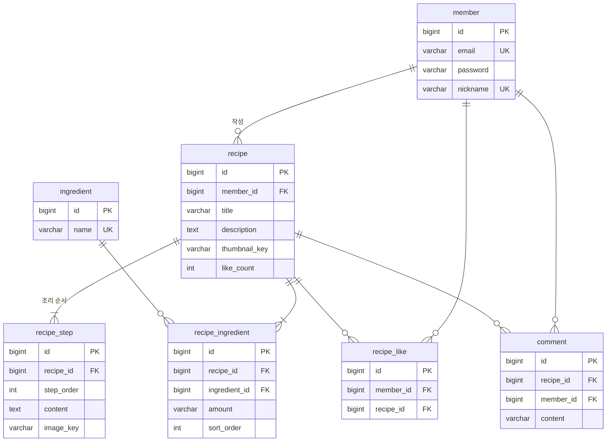

# 레시피 사이트 ERD (MVP)

> 기준일: 2026-10-02 · 상태: 설계 (구현 전)

MVP 기능(회원가입/로그인, 레시피 CRUD, 좋아요·댓글, 재료 검색)에 필요한 MySQL 테이블 7개와, Redis에 저장하는 Refresh Token·로그인 실패 횟수, AWS S3에 저장하는 사진이다.

## 설계 원칙

- **재료는 별도 테이블**: 재료로 검색하려면 레시피 본문 텍스트가 아니라 `ingredient` 행으로 저장해야 한다. 등록 시 같은 이름(앞뒤 공백 제거 후)이 있으면 재사용하고 없으면 만든다.
- **재료 양은 문자열**: "1모", "2큰술", "약간"처럼 입력한 그대로 저장한다. 단위 계산은 하지 않는다.
- **사진은 키만 저장**: DB에는 S3 객체 키(`recipes/1/2026/10/02/3f9c1a2e.jpg`)만 저장하고, 응답할 때 공개 주소를 앞에 붙여 URL을 만든다. 저장소나 사진 주소가 바뀌어도(예: CloudFront 도메인 변경) DB를 고칠 필요가 없다.
- **좋아요 수는 레시피에 캐시**: 목록마다 `COUNT(*)`를 돌리지 않도록 `recipe.like_count`를 두고, DB에서 원자적으로 증감한다.
- **공통 컬럼**: 모든 테이블은 `id BIGINT` PK(auto increment), `created_at`, `updated_at`을 가진다. JPA에서는 `BaseTimeEntity`로 묶어 상속한다. 아래 표에서는 생략한다.
- **FK**: 관계 컬럼에는 DB FK 제약을 둔다. 삭제는 `ON DELETE CASCADE`에 맡기지 않고 서비스에서 자식부터 지운다.

## ERD 다이어그램



## 테이블 명세

### 회원

| 테이블 | 컬럼 | 타입 | 제약·설명 |
| --- | --- | --- | --- |
| member | email | VARCHAR(100) | NOT NULL, UNIQUE |
| member | password | VARCHAR(255) | NOT NULL, BCrypt 해시 |
| member | nickname | VARCHAR(30) | NOT NULL, UNIQUE |

### 레시피·조리 순서

| 테이블 | 컬럼 | 타입 | 제약·설명 |
| --- | --- | --- | --- |
| recipe | member\_id | BIGINT FK → member | NOT NULL, 작성자 |
| recipe | title | VARCHAR(100) | NOT NULL |
| recipe | description | TEXT | 소개글, NULL 허용 |
| recipe | thumbnail\_key | VARCHAR(300) | 대표 사진의 S3 객체 키, NULL 허용 |
| recipe | like\_count | INT | NOT NULL, 기본 0 |
| recipe\_step | recipe\_id | BIGINT FK → recipe | NOT NULL |
| recipe\_step | step\_order | INT | NOT NULL, 1부터. (recipe\_id, step\_order) UNIQUE |
| recipe\_step | content | TEXT | NOT NULL, 조리 설명 |
| recipe\_step | image\_key | VARCHAR(300) | 단계 사진의 S3 객체 키, NULL 허용 |

### 재료

| 테이블 | 컬럼 | 타입 | 제약·설명 |
| --- | --- | --- | --- |
| ingredient | name | VARCHAR(50) | NOT NULL, UNIQUE (두부, 대파…) |
| recipe\_ingredient | recipe\_id | BIGINT FK → recipe | NOT NULL. (recipe\_id, ingredient\_id) UNIQUE |
| recipe\_ingredient | ingredient\_id | BIGINT FK → ingredient | NOT NULL, INDEX (재료 검색용) |
| recipe\_ingredient | amount | VARCHAR(30) | "1모", "2큰술", "약간". NULL 허용 |
| recipe\_ingredient | sort\_order | INT | NOT NULL, 화면 표시 순서 |

### 좋아요·댓글

| 테이블 | 컬럼 | 타입 | 제약·설명 |
| --- | --- | --- | --- |
| recipe\_like | member\_id | BIGINT FK → member | NOT NULL. (member\_id, recipe\_id) UNIQUE → 중복 좋아요 방지 |
| recipe\_like | recipe\_id | BIGINT FK → recipe | NOT NULL |
| comment | recipe\_id | BIGINT FK → recipe | NOT NULL, INDEX (레시피별 댓글 목록) |
| comment | member\_id | BIGINT FK → member | NOT NULL |
| comment | content | VARCHAR(500) | NOT NULL |

## 기능별 핵심 쿼리

| 기능 | 테이블 | 핵심 |
| --- | --- | --- |
| 재료로 검색 | ingredient, recipe\_ingredient, recipe | 재료 이름으로 `ingredient.id`를 찾고, 그 재료가 연결된 레시피를 최신순 페이징 |
| 좋아요 | recipe\_like, recipe | 행 추가와 `like_count + 1`을 한 트랜잭션에서. 중복은 UNIQUE 위반으로 거부 |
| 레시피 목록 | recipe, member | 작성자 닉네임을 fetch join, 페이징. 재료·단계는 상세에서만 조회 |
| 레시피 상세 | recipe, recipe\_step, recipe\_ingredient, ingredient | 단계와 재료를 각각 조회해 N+1 방지 |

재료 검색 예시:

```sql
SELECT r.id, r.title, r.thumbnail_key, r.like_count, r.created_at
FROM recipe r
JOIN recipe_ingredient ri ON ri.recipe_id = r.id
JOIN ingredient i ON i.id = ri.ingredient_id
WHERE i.name = '두부'
ORDER BY r.created_at DESC
LIMIT 20 OFFSET 0;
```

좋아요 수 증가 예시:

```sql
UPDATE recipe SET like_count = like_count + 1 WHERE id = ?;
```

## Redis 저장 데이터 (테이블 아님)

Refresh Token과 로그인 실패 횟수는 MySQL이 아니라 Redis에 저장한다. 이유는 아키텍처 문서의 "Redis를 쓰는 이유"를 따른다.

| 키 | 값 | TTL | 설명 |
| --- | --- | --- | --- |
| `refresh:{memberId}` | Refresh Token의 SHA-256 해시 | 14일 (Refresh Token 유효 기간과 같음) | 로그인·재발급 때 새 값으로 덮어씀(로테이션), 로그아웃 때 삭제. 회원별 1개 |
| `login-fail:{email}` | 로그인 실패 횟수 (숫자) | 15분 (첫 실패 때 설정) | 실패할 때 `INCR`, 5 이상이면 로그인 거부, 성공하면 삭제 |

- 토큰 원문은 저장하지 않는다. 재발급 요청이 오면 받은 토큰을 해시해 저장된 값과 비교한다.
- 키가 없으면(로그아웃·만료) 재발급을 거부한다.

## AWS S3 저장 데이터 (테이블 아님)

| 항목 | 값 |
| --- | --- |
| 버킷 | `STORAGE_BUCKET` 값 (예: `myrecipe-images-본인아이디`, 서울 리전, 비공개) |
| 객체 키 | `recipes/{memberId}/{yyyy}/{MM}/{dd}/{UUID}.{확장자}` |
| 접근 권한 | 버킷은 비공개(퍼블릭 액세스 차단). 읽기는 CloudFront만(OAC), 업로드는 Presigned URL로만, 앱 IAM 사용자는 `recipes/*`만 |
| 공개 URL | `{STORAGE_PUBLIC_URL}/{객체 키}` (CloudFront 주소) |
| DB와의 연결 | `recipe.thumbnail_key`, `recipe_step.image_key`에 객체 키 저장 |

- 키에 회원 ID를 넣어, 레시피 저장 시 "내가 발급받은 키인지"를 확인한다.
- 원래 파일 이름은 쓰지 않는다(중복·이상한 문자 방지).
- 레시피 삭제·사진 교체 시 DB 작업이 끝난 뒤 객체를 지운다. 레시피에 쓰이지 않은 객체(업로드만 하고 저장 안 함, 삭제 실패)는 MVP에서 정리하지 않는다.
