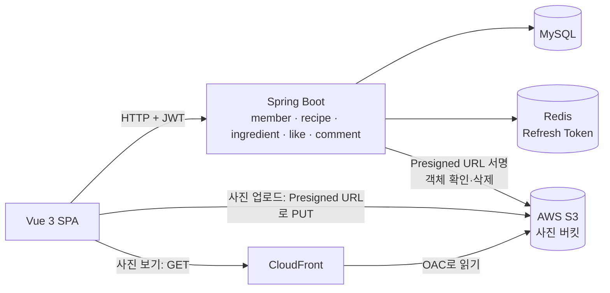

# 레시피 사이트 아키텍처 (MVP)

> 기준일: 2026-10-02 · 상태: 설계 (구현 전)

## 1. 목적과 범위

이 프로젝트는 **공부 중인 백엔드 개념을 직접 만들어 보며 익히기 위한 개인 학습 프로젝트**다. 기능은 작게 유지하고, 각 기능에서 개념을 제대로 적용하는 데 집중한다. 개발 기한은 두지 않는다.

### MVP 기능

| ID | 기능 | 내용 |
|---|---|---|
| F1 | 회원가입/로그인 | 이메일·비밀번호 가입, 로그인 시 JWT 발급 |
| F2 | 레시피 등록·수정·삭제 | 제목, 사진, 재료 목록, 조리 순서. 작성자만 수정·삭제 |
| F3 | 좋아요, 댓글 | 레시피에 좋아요(1인 1회), 댓글 작성·삭제 |
| F4 | 재료로 검색 | 재료 이름(예: "두부")을 넣으면 그 재료가 들어간 레시피 목록 |

레시피 목록·상세 조회는 F2~F4에 포함된다.

### 범위 밖

소셜 로그인, 스크랩, 팔로우, 카테고리·태그, 인분 환산, 식단·장보기, 시세·원가, 냉장고, 알림, AI 기능. 필요해지면 MVP 완성 후 다시 정한다.

## 2. 아키텍처 드라이버

### 학습 목표

| 개념 | 이 프로젝트에서 연습하는 곳 |
|---|---|
| Spring Data JPA | 레시피–재료–조리 순서 연관관계, N+1 문제와 fetch join, 페이징 |
| Spring Security + JWT | 로그인, Access Token·Refresh Token, 토큰 검증 필터, 작성자 권한 확인 |
| Redis | Refresh Token 저장(TTL 자동 만료, 로그아웃·재발급 통제), 로그인 실패 횟수 제한(`INCR` + TTL) |
| AWS S3 + CloudFront | 사진 저장. Presigned URL 업로드, IAM 최소 권한, 퍼블릭 액세스 차단 + CloudFront(OAC)로 보기, 객체 확인·삭제, CORS |
| 동시성 | 좋아요 동시 클릭 시 카운트 정합성 |
| 테스트 | 서비스 단위 테스트, API 테스트(MockMvc) |
| Docker | MySQL + Redis + Spring Boot를 docker-compose로 실행. Spring Boot는 멀티 스테이지 Dockerfile로 이미지화, 컨테이너 간 서비스 이름 통신, named volume으로 데이터 유지 |
| CI/CD | GitHub Actions로 테스트·빌드, Docker 이미지 빌드 확인 자동화 |

Kafka, API Gateway, Kubernetes는 서비스가 여러 개일 때 의미가 있어 MVP에는 넣지 않는다. 확장 과제는 [7. 이후 확장 과제](#7-이후-확장-과제)에 둔다.

### 품질 속성

| ID | 품질 속성 | 시나리오 | 기준 |
|---|---|---|---|
| QA1 | 보안 | 다른 사용자의 레시피·댓글을 수정·삭제하려 한다 | 403 응답. 비로그인 쓰기 요청은 401. 비밀번호는 BCrypt로 저장 |
| QA2 | 정합성 | 같은 사용자가 좋아요를 여러 번 누르거나, 여러 사용자가 동시에 누른다 | 1인 1회만 반영, 좋아요 수가 실제 좋아요 행 수와 일치 |
| QA3 | 성능 | 레시피 목록을 조회한다 | 목록 1페이지 조회에 쿼리 수가 레시피 수에 비례해 늘지 않음(N+1 없음) |
| QA4 | 검색 정확성 | "두부"로 검색한다 | 재료 목록에 두부가 있는 레시피만, 최신순으로 반환 |
| QA5 | 보안(토큰) | 로그아웃한 뒤 예전 Refresh Token으로 재발급을 요청하거나, 이미 한 번 쓴 Refresh Token을 다시 쓴다 | 재발급 거부(401). 재사용이 감지되면 해당 회원의 Refresh Token을 지워 다시 로그인하게 함 |
| QA6 | 사용성 | 로그인한 사용자가 며칠 뒤 다시 접속한다 | Refresh Token 유효 기간(14일) 안이면 다시 로그인하지 않아도 됨 |
| QA7 | 보안(업로드) | 다른 회원이 발급받은 사진 키, 업로드하지 않은 키, 5MB를 넘거나 이미지가 아닌 파일(확장자·Content-Type만 이미지로 위장한 파일 포함)로 레시피를 저장하려 한다 | 레시피 저장 거부(400). Presigned URL은 5분 뒤 무효 |
| QA8 | 보안(로그인) | 한 이메일에 비밀번호를 계속 바꿔 가며 로그인을 시도한다 | 5번 실패 후 15분간 429. 존재하지 않는 이메일과 틀린 비밀번호는 응답 내용·시간으로 구분되지 않음 |
| QA9 | 보안(토큰) | Refresh Token을 Access Token 자리에 넣어 API를 호출한다 | 401. 토큰 종류(`type`)가 다르면 거부 |

### 제약사항

- **C1.** 1인 학습 프로젝트, 개발 기한 없음
- **C2.** 백엔드 Java + Spring Boot, 프론트 Vue + JavaScript
- **C3.** 서버 1대(모놀리스), 로컬 실행을 기본으로 함

## 3. 설계 결정

| 결정 | 선택 | 이유 | 근거 |
|---|---|---|---|
| 서버 구조 | Spring Boot 서버 1개, 도메인별 패키지 | 기능이 작고 학습 목적. 서비스 분리는 확장 과제로 | C1, C3 |
| 인증 | Spring Security + JWT. Access Token(30분, 응답 본문으로 전달, 프론트 메모리에 보관) + Refresh Token(14일, httpOnly 쿠키) | Access Token은 짧게 두어 탈취 피해를 줄이고, Refresh Token으로 로그인 상태를 유지. 오래 사는 Refresh Token은 자바스크립트가 읽을 수 없는 쿠키에 둠 | QA1, QA5, QA6 |
| Refresh Token 저장 | Redis에 회원별 1개, TTL = 토큰 유효 기간, 재발급 때마다 새 토큰으로 교체(로테이션) | 아래 "Redis를 쓰는 이유" 참고 | QA5, QA6 |
| 재료 저장 | 재료 테이블을 따로 두고 레시피와 다대다 연결. 등록 시 같은 이름이 있으면 재사용, 없으면 생성 | 재료로 검색하려면 재료가 텍스트가 아니라 행이어야 함 | F4, QA4 |
| 재료 양 | 문자열로 저장 ("1모", "약간") | 단위 계산 기능이 없으므로 단순하게 | C1 |
| 좋아요 수 | `recipe.like_count` 컬럼 + DB에서 원자적 증감, `(member_id, recipe_id)` UNIQUE | 중복 방지와 동시성 학습 | QA2 |
| 사진 저장 | AWS S3 버킷(서울 리전, 비공개). 업로드는 서버가 발급한 Presigned URL로 브라우저가 직접, 보기는 CloudFront URL. DB에는 객체 키만 | 아래 "AWS S3를 쓰는 이유" 참고 | QA7 |
| 목록 조회 | 페이징 + 필요한 연관만 fetch join | N+1 학습 | QA3 |
| 모듈 간 의존 | 한 방향만 허용(like·comment → recipe). recipe 삭제는 이벤트로 알리고, 여러 모듈을 모으는 상세 조회는 `facade`가 조립 | 순환 참조를 막고, 나중에 서비스 분리·Kafka 이벤트로 이어지게 | C3, 7장 |

### Redis를 쓰는 이유

Redis는 **Refresh Token 저장**과 **로그인 실패 횟수 제한**에 쓴다. 둘 다 "일정 시간이 지나면 저절로 사라져야 하는 작은 데이터"라 TTL이 있는 Redis에 맞다. 아래는 Refresh Token 기준으로 이유를 두 단계로 나눠 정리한다.

**1. Refresh Token을 서버에 저장하는 이유 → 보안(통제)**

JWT는 서버가 따로 기록하지 않으면, 한번 발급한 토큰을 만료 전까지 무효로 만들 방법이 없다. Refresh Token은 14일이나 살아 있으므로 통제할 수단이 필요하다. 서버에 저장해 두면 다음이 가능하다.

- **로그아웃**: 저장된 토큰을 지우면 그 토큰으로는 더 이상 재발급할 수 없다.
- **탈취 대응**: 재발급 요청의 토큰이 저장된 값과 다르면 거부한다. 이미 교체된 예전 토큰이 다시 오면(재사용) 탈취로 보고 저장된 토큰까지 지워 다시 로그인하게 한다.

**2. 저장 장소로 MySQL이 아니라 Redis를 고른 이유 → 편의성과 성능**

| 비교 | Redis | MySQL 테이블 |
|---|---|---|
| 만료 처리 | 키에 TTL을 걸면 기간이 지난 토큰을 Redis가 자동으로 지움 | 만료된 행을 지우는 배치를 직접 만들어야 함 |
| 속도 | 메모리 기반이라 재발급마다 읽고 쓰기가 빠름 | 디스크 기반 |
| 데이터 성격 | 잠깐 쓰고 버리는 데이터에 맞음 | 영구 저장용 업무 데이터에 맞음 |

같은 보안 효과는 MySQL 테이블로도 낼 수 있다. Redis를 고른 것은 그 일을 더 간단하고 빠르게 하기 위해서이고, 이 프로젝트의 학습 목표이기도 하다.

**Redis는 보안 도구가 아니다.** 오히려 Redis를 쓰면 Redis 자체를 지켜야 한다.

- 비밀번호(`requirepass`)를 설정한다.
- 외부에서 접속할 수 없게 한다. 포트는 `127.0.0.1`에만 열고, Spring Boot 컨테이너는 docker-compose 내부 네트워크에서 서비스 이름(`redis`)으로 접근한다.
- 토큰 원문 대신 해시(SHA-256)를 저장해, Redis 내용이 유출돼도 바로 쓸 수 없게 한다.

**MVP 한계** (받아들인 위험): 회원별로 토큰을 1개만 저장하므로, 다른 기기에서 로그인하면 이전 기기는 다음 재발급 때 로그아웃된다. 로그아웃해도 이미 발급된 Access Token은 만료(최대 30분)까지 유효하다. 두 가지 모두 확장 과제로 둔다.

같은 브라우저의 여러 탭이 동시에 재발급해 정상 사용자가 재사용으로 오인되는 문제는 서버 규칙을 느슨하게 하지 않고, 프론트가 Web Locks API로 탭 사이 재발급을 한 번에 하나만 하게 해서 막는다(`INTEGRATION.md` 2장).

### AWS S3를 쓰는 이유

사진은 서버 로컬 폴더가 아니라 **AWS S3**에 저장하고, **CloudFront**(AWS의 CDN)로 보여준다.

처음에는 로컬 docker-compose로 띄우는 S3 호환 저장소 MinIO를 골랐다. 그런데 MinIO가 무료 커뮤니티 버전 배포를 끝내(2026-09, Docker Hub 삭제·quay.io 비공개) 쓸 수 없게 됐다. 포크(SILO)·대체품(RustFS)·과거 버전 직접 빌드를 검토했지만 "작은 조직 의존"이나 "보안 패치 없음" 문제가 남아, 관리 주체가 확실한 AWS S3를 직접 쓰기로 했다. 앱은 처음부터 AWS SDK(S3 API)로만 접속하게 설계해서 코드에는 영향이 없다. 자세한 경위는 `INTEGRATION.md` 1장.

**1. 로컬 폴더 대신 오브젝트 저장소를 쓰는 이유**

| 비교 | 서버 로컬 폴더 | AWS S3 (오브젝트 저장소) |
|---|---|---|
| 서버와의 관계 | 파일이 서버 디스크에 묶임. 서버를 바꾸거나 늘리면 파일을 옮겨야 함 | 서버와 분리. 서버가 몇 대든 같은 저장소를 씀 |
| 파일 제공 | Spring이 파일까지 내려줘야 함 | 브라우저가 CloudFront에서 직접 받음 |
| 운영·관리 | 백업·디스크 관리를 직접 | AWS가 내구성·가용성 관리 |
| 학습 | - | 실무 표준인 S3·IAM·CloudFront를 직접 다룸 |

**2. 업로드를 Presigned URL로 하는 이유**

서버가 파일을 받아 다시 S3에 올리면(서버 경유) 큰 파일이 서버를 두 번 지나간다. Presigned URL 방식은 서버가 **5분짜리 업로드 전용 URL**만 서명해 주고, 브라우저가 S3에 직접 올린다.

- 서버는 파일 바이트를 다루지 않아 메모리·네트워크 부담이 없다.
- URL에 서명이 들어 있어 AWS 접속 키를 브라우저에 주지 않아도 된다.
- 대신 흐름이 한 단계 늘고, 브라우저가 다른 출처(S3)로 요청하므로 버킷에 CORS 설정이 필요하다.

**3. 보기를 CloudFront로 하는 이유**

레시피 사진은 로그인하지 않은 사람도 보는 공개 데이터다. 하지만 **버킷 자체를 공개하지 않는다**. 공개 버킷은 설정 실수 하나로 전체가 노출되는 사고가 흔해서, AWS도 퍼블릭 액세스 차단을 기본으로 켠다.

- 버킷은 비공개로 두고, CloudFront만 OAC(Origin Access Control)로 버킷을 읽을 수 있게 한다.
- 브라우저는 CloudFront 주소의 고정 URL로 사진을 본다. 조회할 때마다 URL을 서명할 필요가 없어 단순하고, CDN 캐시로 빠르다.
- 비공개 파일이 생기면 그때 Presigned GET URL이나 CloudFront 서명 URL을 쓴다(확장 과제).

**지켜야 할 것**

- Presigned PUT은 파일 크기를 제한하지 못한다. 발급할 때 형식·크기를 검사하고, **레시피 저장 때 서버가 S3에서 객체의 실제 형식·크기를 다시 확인**한다. 형식은 Content-Type 헤더만 믿지 않고 파일 앞부분 바이트(매직 넘버)로 확인한다.
- 객체 키에 회원 ID를 넣어(`recipes/{memberId}/...`) 다른 회원의 사진 키를 자기 레시피에 쓰지 못하게 한다.
- 버킷 퍼블릭 액세스 차단을 끄지 않는다. 읽기는 CloudFront 하나에만 허용하고, 목록 조회·업로드·삭제는 아무에게도 공개하지 않는다.
- 애플리케이션은 root 계정·관리자 키가 아니라 `recipes/*` 객체만 다룰 수 있는 앱 전용 IAM 사용자 키를 쓴다.
- 버킷 CORS는 프론트 출처(`http://localhost:5173`)와 `PUT`만 허용한다.
- AWS 계정은 root MFA, 예산 알림을 먼저 설정하고, 키는 `.env`에만 둔다(`INTEGRATION.md` 4장).

**MVP 한계**: 업로드만 하고 레시피에 쓰지 않은 사진, 삭제에 실패한 사진이 버킷에 남을 수 있다. 정리는 확장 과제로 둔다.

## 4. 구성



### 도메인 모듈

| 모듈 | 역할 | 사용하는 다른 모듈 |
|---|---|---|
| member | 회원가입, 로그인, 토큰 발급·재발급·로그아웃 (Refresh Token은 Redis에 저장) | - |
| ingredient | 재료 찾기·생성(이름으로) | - |
| recipe | 레시피 CRUD, 조리 순서, 사진 키 확인(global/storage 사용), 목록, 재료 검색. 삭제 시 `RecipeDeletedEvent` 발행 | member, ingredient |
| like | 좋아요 추가·취소, 좋아요 수 증감(recipe Service 호출). `RecipeDeletedEvent`를 받아 좋아요 삭제 | member, recipe |
| comment | 댓글 작성·삭제·목록. `RecipeDeletedEvent`를 받아 댓글 삭제 | member, recipe |
| facade | 여러 모듈을 모아야 하는 응답 조립. 레시피 상세(`likedByMe`, `commentCount` 포함) | recipe, like, comment |
| global | 보안 설정, JWT 필터, 예외 처리, 공통 응답, BaseTimeEntity, AWS S3 연동(Presigned URL 발급, 객체 확인·삭제) | - |

**의존 방향 규칙**

```text
            facade
          ↙   ↓   ↘
      like  comment  │
          ↘   ↓     ↓
            recipe ──→ member, ingredient
```

- 의존은 화살표 방향으로만 한다. recipe는 like·comment·facade를 모른다(import하지 않는다). 거꾸로 부르는 코드가 필요해지면 이벤트나 facade로 푼다.
- recipe 삭제처럼 "recipe에 일이 생겼으니 다른 모듈도 처리해야 하는" 경우는 recipe가 이벤트를 발행하고, 관심 있는 모듈이 리스너로 처리한다. recipe는 누가 듣는지 모른다.
- 여러 모듈의 데이터를 합친 응답은 `facade`가 각 Service를 불러 조립한다. 도메인의 Service·Repository·Entity는 facade를 모르고, Controller만 facade를 호출한다.
- 다른 모듈의 Repository를 직접 쓰지 않고 Service를 통해서만 접근한다. API 경로와 요청·응답 형식은 `API_SPEC.md`를 따른다.

이 구조는 서비스를 나눌 때 그대로 이어진다. `RecipeDeletedEvent`는 Kafka 메시지로, facade는 API 조합 계층으로 바뀐다(7장).

## 5. 핵심 흐름

### 회원가입·로그인

1. 가입: 이메일 중복 확인 → 비밀번호 BCrypt 암호화 → `member` 저장
2. 로그인: 이메일·비밀번호 확인 → Access Token과 Refresh Token 발급 → Refresh Token 해시를 Redis에 `refresh:{memberId}` 키로 저장(TTL 14일) → Access Token은 응답 본문, Refresh Token은 httpOnly 쿠키로 전달
3. 이후 요청: `Authorization: Bearer {Access Token}` 헤더를 JWT 필터가 검증하고 로그인 사용자를 SecurityContext에 넣음
4. 재발급: Access Token이 만료되면 프론트가 `POST /api/auth/refresh` 호출 → 쿠키의 Refresh Token을 검증(서명·만료) → Redis에 저장된 해시와 비교
    - 일치: 새 Access Token과 새 Refresh Token 발급, Redis 값을 새 해시로 교체(로테이션), 새 쿠키 전달
    - 불일치(이미 교체된 예전 토큰): 재사용으로 보고 Redis 키를 지우고 401 → 다시 로그인
    - Redis에 키가 없음(로그아웃했거나 만료): 401 → 다시 로그인
5. 로그아웃: `POST /api/auth/logout` → Redis 키 삭제, 쿠키 삭제

### 레시피 등록

1. 프론트가 사진마다 `POST /api/images/presigned-url`로 업로드 URL과 객체 키를 받음 (서버가 형식·크기 확인, 키에 회원 ID 포함)
2. 프론트가 그 URL로 S3에 사진을 직접 `PUT`
3. 레시피 정보(제목, 설명, 사진 객체 키, 재료 목록, 조리 순서)를 JSON으로 받음
4. 사진 키마다 확인: 내 회원 ID로 시작하는지, S3에 객체가 있는지, 실제 형식·크기가 맞는지 (아니면 400)
5. 재료마다 이름을 다듬어(앞뒤 공백 제거) `ingredient`에서 찾고, 없으면 생성
6. 한 트랜잭션에서 `recipe`, `recipe_ingredient`, `recipe_step` 저장

등록·수정 응답(레시피 상세 형식)은 저장이 끝난 뒤 facade가 상세 조회로 만든다.

수정은 작성자인지 확인한 뒤 재료·조리 순서를 새 목록으로 교체한다.

삭제는 한 트랜잭션에서 아래 순서로 한다.

1. 작성자 확인
2. `RecipeDeletedEvent(recipeId)` 발행 → like·comment의 `@EventListener`가 **같은 트랜잭션 안에서** 좋아요·댓글을 지움 (리스너가 실패하면 전체 롤백)
3. 재료 연결·조리 순서·레시피 삭제 (recipe 모듈 자신의 데이터)

더 이상 쓰지 않는 사진은 DB 트랜잭션이 끝난 뒤 S3에서 지우고, 실패하면 로그만 남긴다(S3 삭제는 DB 트랜잭션으로 되돌릴 수 없으므로 커밋 후에 한다).

### 재료로 검색

1. 검색어를 다듬어 `ingredient.name`과 일치하는 재료를 찾음
2. 그 재료가 연결된 레시피를 최신순으로 페이징 조회 (`recipe_ingredient(ingredient_id)` 인덱스 사용)

"달걀"과 "계란"처럼 다른 이름은 같은 재료로 묶지 않는다(MVP 한계).

### 레시피 상세

facade가 recipe Service(레시피·재료·조리 순서), like Service(`likedByMe`), comment Service(`commentCount`)를 불러 하나의 응답으로 합친다.

### 좋아요·댓글

- 좋아요: like Service가 recipe Service로 레시피 존재를 확인하고, `recipe_like` 행 추가 + recipe Service의 좋아요 수 증가(`UPDATE recipe SET like_count = like_count + 1`)를 한 트랜잭션에서. 이미 눌렀으면 UNIQUE 제약으로 거부. 취소는 반대로
- 댓글: 로그인 사용자만 작성, 작성자만 삭제

## 6. 실행과 배포

로컬 실행은 Docker 기반이고, 방법은 두 가지다. 자세한 설정은 `INTEGRATION.md` 1장을 따른다.

| 모드 | Docker로 실행 | 내 컴퓨터에서 실행 | 용도 |
|---|---|---|---|
| 개발 모드 | MySQL, Redis | Spring Boot(`bootRun`), Vue | 평소 개발·디버깅 |
| 전체 컨테이너 모드 | MySQL, Redis, **Spring Boot** | Vue | 배포와 같은 형태로 확인, 다른 PC에서 한 번에 실행 |

- Spring Boot 이미지는 멀티 스테이지 Dockerfile로 만든다(빌드: JDK + Gradle → 실행: JRE + jar만, root가 아닌 사용자로 실행).
- 컨테이너끼리는 서비스 이름(`mysql`, `redis`)으로 접속한다. 사진은 두 모드 모두 AWS S3를 쓴다. 모든 주소·비밀 값은 환경 변수로 받는다.
- CI: GitHub Actions에서 push·PR마다 테스트와 jar 빌드. Docker 이미지 빌드는 6단계에서 추가(레지스트리 푸시는 하지 않음)
- 외부 배포(EC2 등)는 MVP 완성 후 선택

## 7. 이후 확장 과제

MVP를 완성한 뒤 공부 중인 개념을 더 연습하고 싶을 때의 후보다. 지금 구현하지 않는다.

| 과제 | 연습하는 개념 |
|---|---|
| member와 recipe를 별도 서비스로 분리하고 Spring Cloud Gateway로 라우팅·JWT 검증 | MSA, API Gateway |
| 좋아요·댓글 발생을 Kafka 이벤트로 발행하고 다른 서비스(예: 알림)가 소비 | Kafka, 이벤트 기반 통신 |
| 분리한 서비스를 Kubernetes에 배포 | Kubernetes |
| GitHub Actions로 Docker 이미지를 레지스트리에 푸시하고 서버에 배포까지 자동화 | CI/CD |
| Vue도 Nginx 컨테이너로 만들어 정적 파일과 `/api` 프록시를 함께 처리 | Docker, Nginx |
| 로그아웃한 Access Token을 남은 유효 시간만큼 Redis에 넣어 즉시 차단(블랙리스트) | Redis, 보안 |
| 기기별 Refresh Token 저장(`refresh:{memberId}:{기기ID}`)으로 여러 기기 동시 로그인 | Redis, 인증 설계 |
| 레시피에 쓰이지 않은 사진 정리 (S3 수명 주기 규칙 또는 정리 배치) | S3, 스케줄러 |
| 업로드된 사진의 썸네일 자동 생성 (S3 이벤트 → Lambda) | S3 이벤트, 서버리스 |
| AWS 인프라(S3·CloudFront·IAM)를 Terraform 코드로 관리 | IaC |
| 로컬 개발용 키 대신 IAM Identity Center(SSO) 임시 자격 증명 사용 | AWS 보안 |
